# <div align="center">The Blockchain Quiz</div>

View the live site [here](https://trdownie.github.io/the-blockchain-quiz/).

This website is a quiz on blockchain technology. It is responsive, therefore accessible on a range of devices. The purpose of this site is to edutain: entertain and educate at the same time. This website also forms part of my diploma in Full Stack Development with the Code Institute, specifically interactive frontend development. As such, this site has been developed using HTML5, CSS3 and JavaScript, with an emphasis on using JavaScript where appropriate to make the website interactive.

<div align="center">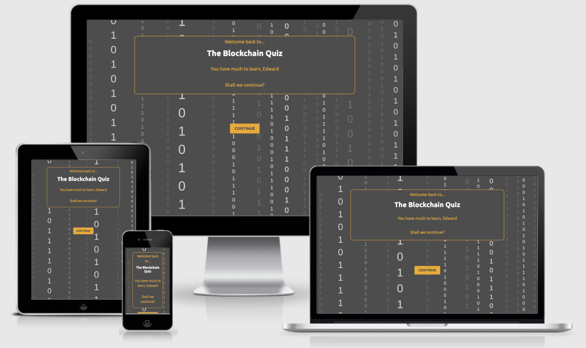</div>
-----------------------------

## <div align="center">PART 1: DESIGN</div>
### <div align="center">User Experience (UX)</div>

The design of the site began with target user objectives in mind and worked up from there. The process is detailed here.

#### **User Stories**

The primary users of this site will be individual who want to test their existing knowledge and potentially learn more about Blockchain technology in an entertaining setting. They will want:
1.	To understand immediately and with definitive clarity the purpose of the site and its relevance to them in their quest to learn more about Blockchain.
2.	To test their existing Blockchain knowledge.
3.	To fill any Blockchain knowledge gaps.
4.	To enjoy using the site.
5.	To learn more about the site and its purpose.
6.	To connect with the creator of the site since this is a burgeoning field.

Return visitors will want to:
1.	Have a positive returning experience.
2.	Try the quiz again to determine if they have more to learn. 

#### **Design**

##### *Strategy*
The strategy of the website must align with the user goals above. These are simple in nature, the main focus being the quiz and how it tests knowledge and informs users.

The primary goal of this website, therefore, is to present to the user a quiz that is simple to navigate, and that allows the user the opportunity to plug any knowledge gaps they might have.

The secondary goal of this website is elicit a positive feeling in the user so that they might want to return, or better still to connect with me on social media to help us both develop our networks.

##### *Scope*
The scope of the website is to achieve the strategic goals outlined above. The most practical way to achieve this is to allow the user access to the quiz immediately upon landing on the website. Too much clutter or distraction detracts from this pleasant experience and might be enough resistance to send the user elsewhere.

The main scope considerations are:
- The landing page will display to our target users that this site is exactly what they are looking for.
- From the landing page, the user will be invited to take part in the quiz immediately.
- Upon embarking on the quiz, there are two outcomes for each question,
    - either a correct answer, leading to another question,
    - or an incorrect answer, leading to information that helps the user learn more and retry the quiz from the beginning (to solidify the information and help the user learn). At this stage the user will get a ‘rank’ based on someone in the Bitcoin space to make the process fun.
- On completing the quiz with 100% the user will be presented with a reward (an algorithmically produced piece of art) to elicit a positive feeling, and their name will be added to the leaderboard of the site.
- Finally, there will be an option to learn more about the site and to connect with me but only once they have completed the quiz. This serves as a filter for those who are genuinely interested in learning, or those who already know their stuff. This gives these users exclusivity which further adds to the desire to contacting me.

The content considerations are:
- The website is interactive; therefore, it will involve a combination of buttons to click, toggle buttons/drag and drop words/input fields for answering questions, and pop-ups that inform the user of different things.
- Text will be used for questions and explanations.
- Images will be used for giving the user a rank and if needed to explain a concept.
- A form will be used for contacting me.
- The final page will present a canvas to the user in which an algorithmically generated piece of artwork will be available for downloading.

##### *Structure*
The website is a quiz – it has a single and concise purpose. As such, no complex structure is warranted, and since JavaScript will be utilised, this allows for a basic structure that JavaScript can then manipulate as the user interacts with the site.

The website structure will be as follows:
1.	Landing Page: including,
- A title as to what the website is
- The option for users to play the quiz
- A special mention for return users
- An option for previous winners to sidestep the quiz and learn more about the project or contact me since they have already completed it
2.	Question Page: a question page that users interact with and that either progresses through the 10 questions in order, or tells the users they have failed, informs them of why to educate them, and allows them to return to the beginning
3.	Winners Page: a page dedicated to those who have completed the quiz, presenting the winners with:
- A congratulation message from me
- Their place on the scoreboard
- A unique piece of art that is algorithmically generated
- The option to contact me or connect with me on social media
- The option to learn more about the site

The website will not have header or footer navigation as this will take away from the experience of the site and the strictly controlled nature of navigation/information flow.

Information flow for the website is a consistent and single flow of information from landing page, to ‘question loop’ and eventually to the winner’s area. The question loop is the loop from question 1 – 10 that takes those who answer incorrectly back to the beginning indefinitely until they succeed or leave the site. The idea is to make the users want to complete the quiz to beat it, and ultimately then to want to contact me as this is ‘only available to winners’ and therefore users may be inclined to contact me so that I know they have beat the quiz.

Navigation for the website is almost non-existent. There is the landing page, then an infinite question loop that users can only escape by correctly completing the quiz or leaving the site completely having failed. Again, this deviation from convention is intentional and strategic to elicit an emotional response from the user and make them want to play the quiz, to beat the quiz (ultimately learning what they don’t know), and to find out more/contact me.

Interaction is used throughout the site. Specifically:
- Upon landing on the site, the user will be greeted with one of three welcome pages depending on whether they have played before.
- The user will click on the button to take them into the quiz, which will contain three types of questions:
    - Toggle button questions
    - Input field questions
    - Drag and drop word questions
- Depending on whether the answer is correct or incorrect, the user will be met with more questions (initially 10 for practical purposes) or a modal will pop up to inform them of their incorrect answer and explain why, proving a link to retry the quiz.
- Upon completion, the user will be presented with a ‘receive prize’ button that will provide them with a piece of art (an image) that is algorithmically generated and totally unique.

##### *Skeleton*
Initial sketches on paper led to the following [wireframes](https://www.figma.com/file/VvGE6j9pl40ixttaedECee/The-Blockchain-Quiz?node-id=0%3A1) being developed using Figma.

<div align="center">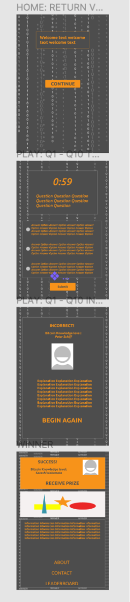</div>

As you can see, the layout is simple and does not follow a conventional website layout. This is intentional, as the idea is to immerse the user into the quiz and not provide links out and away from the site.

The following features are on display here:
- Landing Page: A landing page with a welcome message and button to begin the quiz.
- Question Page: A question page displaying a timer, the question, the option for the user to select the correct answer, and a submit button.
- Incorrect Answer: An incorrect answer modal will appear when a user enters incorrect information presenting the user with a light-hearted rank based on prominent figures in the Bitcoin world
- Winners Page: A winners are is available for those who complete the quiz fully, providing a few additional features.
    - Prize: a prize is presented, specifically a unique piece of artwork generated using the hashes from the blockchain network
    - About: a modal will appear providing basic information about the site
    - Contact: a modal will appear with a form for the user to input contact details and connect via Twitter
    - Leaderboard: a modal will appear with a mock leaderboard of previous winners. Each name will be Satoshi Nakamoto as a nod to the pseudonymous nature of the developer.

Colour and typography were used during wireframing to ensure the minimalistic design was still appealing.

##### *Surface*
Following the wireframes, the final step of design was to create in-depth [mockups](https://www.figma.com/file/VvGE6j9pl40ixttaedECee/The-Blockchain-Quiz?node-id=0%3A1). These were also created in Figma.

<div align="center"></div>
<div align="center">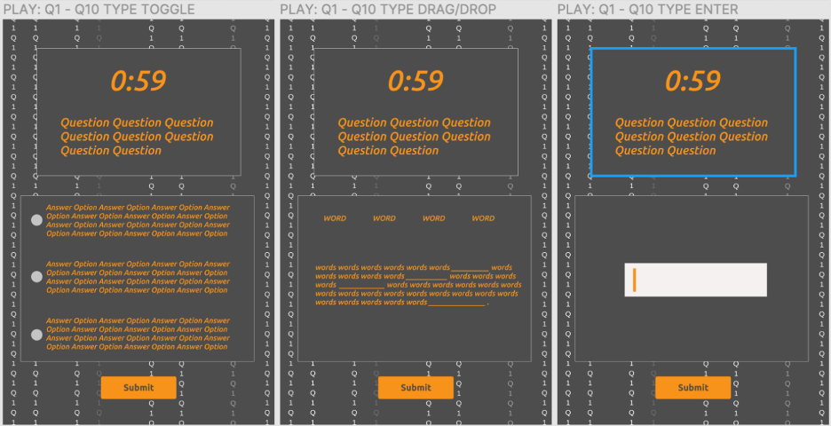</div>
<div align="center">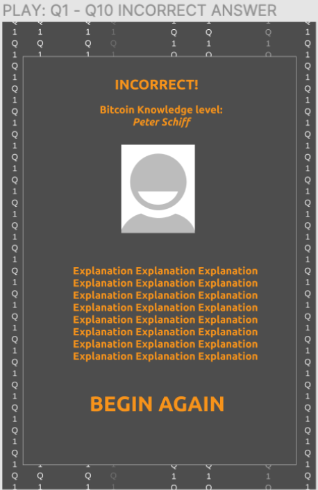</div>
<div align="center"></div>


Regarding typography, Ubuntu was used. Ubuntu is a humanist sans serif font family designed by London-based type foundry [Dalton Maag](https://fontmeme.com). This font was chosen since it is the font used in the Bitcoin logo. I also believe it is appealing in this setting. To differentiate, since only one font is being utilised, italic and bold will be used throughout the site.

The colour scheme employed is the grey, orange and white of the Bitcoin logo, as per designpieces.com (see below). In addition, to increase the style and contrast, extra greys have been used in the background imagery.
 
<div align="center"></div>

Imagery used here in three instances. First, the background used throughout the site is the commonly used ‘matrix’ style of binary code, popularised in the Matrix movie. This was developed using Canva, and the 1’s and 0’s change from the landing page to the question pages according to the question the user is on. Second, the user is given a rank depending on how well they do in the quiz, and images are used to convey this rank. Third, on the winner’s page, a JavaScript algorithm will pull hashes from the original blockchain source code via API and use this to produce unique art for the user.

The copy used is strictly functional as this is not a traditional website. As such, it is resigned to question, information, and navigation.

-----------------------------

### <div align="center">Features</div>

Features used in this project are laid out here.

#### **Landing Page**
The landing page has three formats: new users, returning non-winners, and returning winners.

The new users landing page has a welcome message telling the users what the site is, and a single button: begin. ‘Begin’ is used as a nod to The Matrix movie, since Morpheus asks, ‘shall we begin?’ during the training phase.

The returning non-winners landing page provides the additional feature of welcoming the user back based on their previous rank, alongside a comment that is also individualised based on previous rank. The button is also different, ‘continue’ being used for obvious reasons.

The returning winners landing page allows for the above features as well as an option to learn more about the site or contact myself. These will be in modal form, identical to the winner’s page.

#### **Question Page**
The question page is a single page for the whole quiz whereby the elements change with the user’s interaction. The question page also has three formats: toggle question, drag/drop question, and input question.

The toggle question presents users with a question followed by three options, and a toggle button for users to select their answer.

The drag/drop question presents users with a statement and a collection of drag/drop words that they must move into place to answer the question.

The input question requires users to input their answer to the question to proceed.

All three question page types contain a countdown timer (from 1 minute), the question being asked, and a submit button. The background of each page will change based on the question to include the question number.

#### **Winner's Page**
The winner’s page comprises of three unique elements: a success pane, a canvas, and an information panel.

The success pane contains the ultimate rank (Satoshi Nakamoto) and a button for the user to receive their prize, which is displayed on the canvas below. 

The canvas will begin blank, but upon user interaction will design a completely unique piece of art that is based on the unique hash from the blockchain ran through a predetermined algorithm to produce the artwork.

The information panel contains an explanation of the artwork, an option to download it as an image, the option to purchase it as an NFT (via a contact form on a modal), and buttons to find out more (about), contact me (contact), or view the leaderboard (leaderboard). The outputs from these three buttons will appear in a modal on screen.

-----------------------------

## <div align="center">PART 2: DEVELOPMENT</div>
### <div align="center">Development, Responsiveness & Accessibility</div>

The development was done in three stages. First, the site was built section-by-section and page-by-page using a mobile-first approach based on a small screen size (circa 500px). Second, the necessary steps were taken to ensure compatibility with a range of screen sizes. Third, amendments and additions were made to ensure accessibility for a range of viewing approaches. This section outlines these three steps in turn.

#### **Initial Development**
The following is a series of notes that explain any development-related issues on the first development run, as well as any deviation from convention. Naturally, the HTML was first created, then then the CSS, and finally the JavaScript was added. These notes follow the same convention.

##### **Index (Landing Page)**
The landing page, much like the entire site, is relatively basic in design. The background image was created using Canva, and the HTML & CSS were constructed without any significant content, since JavaScript DOM manipulation was implemented to add the text.

<div align="center"></div>

Since the quiz is simple by nature, animated text was utilised to add style/character. The animations used took two forms: typewriter text and fade in text.

The typewriter text was initially constructed from [W3 Schools](https://www.w3schools.com/howto/howto_js_typewriter.asp), however I decided to instead create my own code for this that avoided the use of recursion; although it would not have caused an issue here, this was simply good practice. The code used is below, where the text parameter is the text to be typed, and the element is the HTML element the text will be added to via DOM manipulation.

```javascript
function typeText(text, element) {
    // speed is speed of typing
    let speed = 50
    // i used here for iteration purposes
    let i = 0
    // function to iterate through the letters of the question in array form 
    for (letter of text) {
        type(letter, i);
        i++;
    }
    // function called above that types each letter and iterates
    function type(letter, i) {
    setTimeout(function() {
        document.getElementById(element).innerHTML += letter;
    }, speed * i);
    }
}
```

I was, at the time, unsure on how to create a ‘fade in’ function since it was my first attempt at JavaScript animation. As such, I found the code below on [Stack Overflow]( https://stackoverflow.com/questions/2207586/how-do-you-make-something-to-appear-slowly-on-a-page-using-javascript). Now, in hindsight, I’m aware how simple this code actually is. The opacity is incremented in steps until it reaches 1 (or 0 on disappear) at a speed dependant on the parameter fed into the function. In the future, I will handle such manipulation myself without assistance. I would have rewritten this code, however I like the way it has been implemented and any attempt to rewrite would be replicative.

```javascript
function appear(element, num, step, speed){
    var changeOpacity;
    changeOpacity = setInterval(function(){
        var opacity = num / 100;
        num = num + step; 
        if (opacity > 1 | opacity < 0){
            clearInterval(changeOpacity);
            return; 
        }
        // modern browsers
        element.style.opacity = opacity;
        // older IE
        element.style.filter = 'alpha(opacity=' + opacity*100 + ')';
    }, speed);
}
```

In addition to the animation, the entire welcome message is tailored based on a user’s previous best level. As you can see, everything except the title changes based on the user’s previous score.

<div align="center">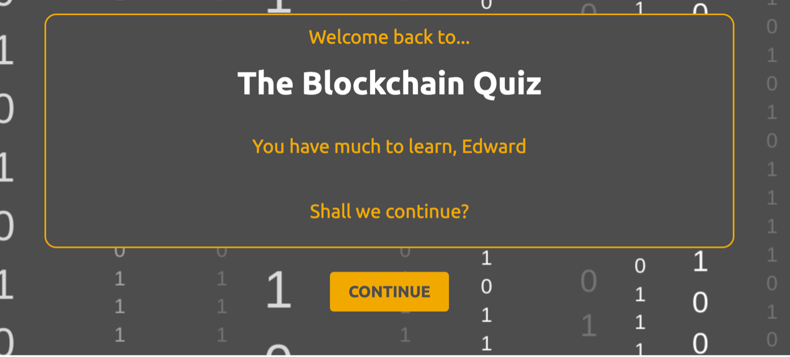</div>

To achieve this, two things were needed. First, multiple arrays containing the elements that would be displayed were required. I decided to use arrays and not more complex objects to ensure the code remained simple for accessing these objects. Second, local storage was implemented on page load, as shown below. 

```javascript
    // obtains previous user level, or sets it to zero if there isn't one
    let previousTopLevel = window.localStorage.getItem("User Level");
    let previousTopScore = window.localStorage.getItem("User Score");
    if (previousTopLevel === null){
        window.localStorage.setItem("User Level", "0");
    }
    if (previousTopScore === null){
        window.localStorage.setItem("User Score", "0");
    }

    // gets previous user level & user score (which are now zero on first run)
    let previousTopLevelString = window.localStorage.getItem("User Level");
    let previousTopScoreString = window.localStorage.getItem("User Score");    

    // converts previous user level/score to integers (this is why zero is required earlier)
    let previousLevel = parseInt(previousTopLevelString, 10);
    let previousScore = parseInt(previousTopScoreString, 10); // not used but set for future enhancements
```

I decided to use modals throughout this project. I understand their limitations in certain use cases – however, I feel in this instance they are not only warranted but improve and help control site navigation. Modal functionality was also learnt from [W3 Schools]( https://www.w3schools.com/howto/howto_css_modals.asp). Again, this is relatively simple, but due to JavaScript’s extensive functionality, the first time implementing anything will require a level of ‘borrowing’ from authorities on it. I’m grateful the industry accepts this as commonplace.

As you can see from the initial modal – this forces the user to engage with the rules, whereby placing them arbitrarily on the home page may now. In addition, this leaves navigation entirely in my control, something that I feel adds to the immersive experience here, contrasting with many online applications that overload the user with unexpected pop-ups, sidebars, etc.

I have also utilised emojis throughout the project. I feel these add symbolic meaning and context in an everyday way, engage with the reader in a light-hearted way that tempers any wooden copy, and spruce up an otherwise plain website.

<div align="center">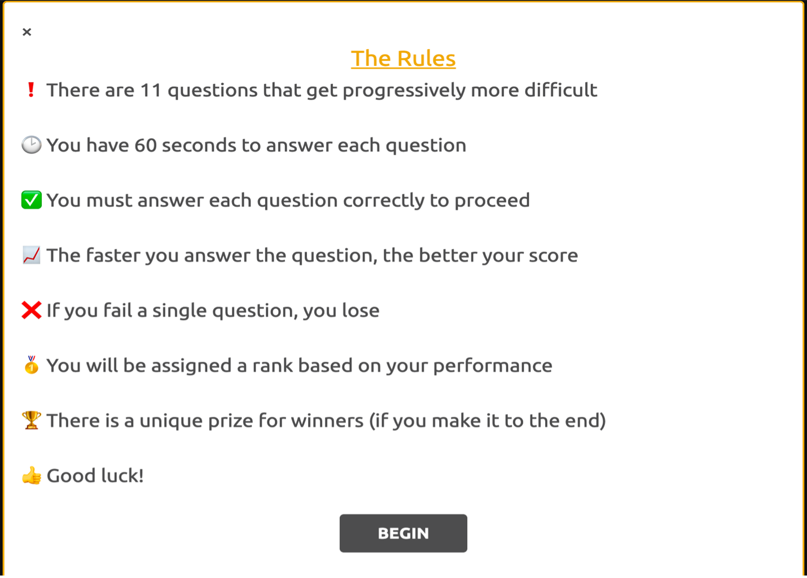</div>

##### **Quiz**
The quiz page maintains the same style as the landing page, with minimal HTML and the JavaScript doing the heavy lifting. 

<div align="center"></div>

The same typewriter and appear functions were utilised here, so as not to make the animation seem overly gimmicky. Animation is not always desirable, and by keeping the same format it lets the user get used with what to expect. Here, on page load, the following series of events are triggered in order:

- The question number is displayed
- The question is typed out
- The timer appears at 1:00
- The answer box and submit button appear
- The timer begins

I felt this order braces the user for what is to come, while allowing the user time to process the question before the clock begins. The typing animation seeks to draw the user’s attention straight to the question, again immersing them into the experience.

Regarding the answer box, these were constructed in HTML in a way so that all are hidden by default and appear in turn based on event listeners, specifically page loads and submit button clicks. This allows JavaScript to control the questions being displayed without excessive use of DOM manipulation. HTML form elements were used for the questions, each with its own submit button.

There are three types of question: multiple choice (displayed above), drag and drop, and input.

Multiple choice questions utilised the form element and simple radio buttons.

Drag and drop questions make use of the Drag & Drop API. I read many guides on how to do this, however I found the guide from [MDN Web Docs]( https://developer.mozilla.org/en-US/docs/Web/API/HTML_Drag_and_Drop_API) to be the best for understanding the functionality of this feature.

<div align="center"></div>

The code used to achieve this functionality is below. Considering the nature of the functionality, this was impressively simple to implement. (Note: the final line of code – this is referred to later within the Quiz Logic section.)

```javascript
// ---------------------------------  DRAG AND DROP FUNCTION
// code triggered repeatedly when one of the word options are dragged
function drag(dragEvent){
    dragEvent.dataTransfer.setData("text", dragEvent.target.id);
}

// code triggered when word is dragged over drop box to prevent the default mode which disallows dropping
function allowDrop(dropEvent){
    dropEvent.preventDefault();
}

// code triggered on the dropping of a word into the drop box
function drop(dropEvent){
    dropEvent.preventDefault();
    // assigns the text data (here the ID) to the variable data
    var data = dropEvent.dataTransfer.getData("text");
    // adds the dropped element to the drop box area
    dropEvent.target.appendChild(document.getElementById(data));
    // adds the data (the ID) to the drag and drop answers to be used in assessAnswer()
    dragAndDropAnswersGiven.push(String(data));
```

Input type questions simply changed the traditional multi-choice input for an input field that would take numbers. Input questions were only chosen for those that required numerical input for obvious reasons.

<div align="center"></div>

The clock was designed to begin ticking once everything had loaded. The code for the clock is below. Simple conditionals were used here to adjust the inner HTML of the element. Upon reaching zero, a skull and cross bones emoji is displayed.

```javascript
// starts timer and sets event listener ready for each question
function beginTimer (userLevel, userScore, seconds){
    let timer = document.getElementById('timer')
    // begin interval after 1 second and repeat every second until seconds = 0
    let countdown = setInterval(function(){
        if (seconds > 9) {
            timer.innerHTML = '0:' + seconds;
            seconds-- ;
        }
        else if (seconds <= 9 && seconds > 0){
            timer.innerHTML = '0:0' + seconds;
            seconds-- ;
        }
        else if (seconds == 0){            
            timer.innerHTML = '&#128128'; // skull emoji on time up
            seconds-- ;
        }
        else {
            loserModal(userLevel, userScore)
            clearInterval(countdown);
        }
    }, 1000);
    // adds event listener once timer begins to clear timer and assesses answer
    submitButton[userLevel].onclick = function(){
            assessAnswer(userLevel, userScore, seconds);
            clearInterval(countdown);
    }
}
```

##### **User Level & User Score**
When a user submits an answer, the JavaScript determines where it is correct or not based on an array of correct answers stored within the JavaScript itself. If the user gets the answer correct, the previous question is removed and the next question is loaded. This functionality, much like all of the functionality throughout the quiz, is determined by the user’s ‘User Level’.

Upon a new user arriving to the quiz, the user’s User Level (and User Score) is set to zero (as seen earlier). This is stored in the user’s local storage and updated as the user progresses through the quiz. Each time a user answers the next question in the chain, their User Level increases by 1. If they fail, they must begin again from the beginning, however their best User Level will be remembered for them arriving at the home page in the future. This allows the JavaScript to display greetings and questions, assess answers, and provide feedback to the user. 

The user’s User Score is used in the same way, however the user’s User Score is based on how quickly they answer a question. If they answer a question with 50 seconds on the timer, they get 50 points added to their User Score. The site also remembers the user’s best User Score so that they can see when a new top score is achieved.

##### **Quiz Logic**
The quiz logic is important for understanding how the quiz works. The process is summarised below.

On DOM content load, the quiz sets the user’s User Score and User Level to zero and asks the user a question based on these levels. Asking a question here includes the animated appearance of the question, as well as the timer being reset (and the previous question disappearing on later levels). This essentially ‘enters’ the quiz loop.

```javascript
document.addEventListener("DOMContentLoaded", function(){
    
    // sets the userlevel / userscore for the current game
    var userLevel = 0
    var userScore = 0

    // begins quiz
    displayQuestion(userLevel, userScore);
})

The display question function is shown below. As you can see, it is comprised of carefully timed functions that control the presentation of the question screens. Here, the userLevel variable is key to managing this process.

// loads question & answer box based on userLevel
function displayQuestion(userLevel, userScore){

    // adds the question number to the question title based on userLevel
    displayQuestionNumber(userLevel)

    // asks the question in typewriter text based on userLevel
    askQuestion(userLevel)
    
    // fades timer in on first question (after 2 seconds)
    // resets the timer to 1:00 for every other question
    resetTimer(userLevel)
    let seconds = resetTimer()

    // displays answer box after question has loaded (after 2.5 seconds)
    displayAnswerBox(userLevel)
    
    // starts 60 second timer once answer box has loaded (after 3.5 seconds)
    setTimeout(function(){
        beginTimer(userLevel, userScore, seconds)
    }, 3500)
}
```

Once this has been performed, on initial screen load and on subsequent occurrences, another event listener is triggered. That is because the begin timer function (displayed below) triggers an event listener based on the user’s User Level (see last three lines of code). This again makes use of an array of event listeners that exist within the JavaScript file.

```javascript
// starts timer and sets event listener ready for each question
function beginTimer (userLevel, userScore, seconds){
    let timer = document.getElementById('timer')
    // begin interval after 1 second and repeat every second until seconds = 0
    let countdown = setInterval(function(){
        if (seconds > 9) {
            timer.innerHTML = '0:' + seconds;
            seconds-- ;
        }
        else if (seconds <= 9 && seconds > 0){
            timer.innerHTML = '0:0' + seconds;
            seconds-- ;
        }
        else if (seconds == 0){            
            timer.innerHTML = '&#128128'; // skull emoji on time up
            seconds-- ;
        }
        else {
            loserModal(userLevel, userScore)
            clearInterval(countdown);
        }
    }, 1000);
    // adds event listener once timer begins to clear timer and assesses answer
    submitButton[userLevel].onclick = function(){
            assessAnswer(userLevel, userScore, seconds);
            clearInterval(countdown);
    }
}
```

Once this event listener is in place, the ball is passed to the user while the clock counts down. Upon the user submitting an answer (within time), then the assess answer function is triggered (below). This triggers one of three sub-functions that will determine if the user’s answer is correct based on the question type, which is again obtained from an array using the user’s User Level.

```javascript
// assess whether correct and adjust user level/score or run fail modal
function assessAnswer(userLevel, userScore, seconds){
    // answer variable defines the correct answer based on the question number (userLevel)
    var questionType = questionTypeList[userLevel];
    switch (questionType){
        // for multi-choice questions
        case 1:
            assessMultiChoiceAnswer(userLevel, userScore, seconds);
        break;
        // for drag & drop questions
        case 2:
            assessDragAndDropAnswer(userLevel, userScore, seconds);
        break;
        // for input questions
        case 3:
            assessInputAnswer(userLevel, userScore, seconds);
        break;
    }
}
```

The three sub-functions are detailed below. All three functions share common ground. They each utilise conditionals to determine if the answer is correct. If it is correct, the increment the user’s User Level and User Score appropriately and display another question, or, by way of a nested conditional, if the user has reached the final level (11), they will display a winner modal. Furthermore, if the user’s answer is incorrect, all three will display the fail modal.

Where they differ is in determining whether the answer is correct.

The multi-choice function uses the user’s User Level and the querySelector function to obtain the value of the selected radio button from the associated form and compares this with the correct answer from the correct answer list (array).
 
```javascript
// assesses multi-choice answers
function assessMultiChoiceAnswer(userLevel, userScore, seconds){
    var correctAnswer = correctAnswerList[userLevel];
        // targets input answer via the submit button according to different html form elements (each answer has its own form)
    var answerGiven = document.querySelector('input[name="' + answerSelector[userLevel] + '"]:checked').value;
    // determines if answer is right or wrong
    if (answerGiven == correctAnswer){
        userLevel ++;
        userScore += seconds;
        // when correct, display another question based on user level until Q11
        if (userLevel < 11){
            displayQuestion(userLevel, userScore);
        }
        // then display winner modal
        else {
            winnerModal(userLevel, userScore);
        }
    }
    // if wrong answer given, display loser modal
    else {
        loserModal(userLevel, userScore);
    }
}
```

The drag and drop function uses an earlier-defined, empty, global array (named dragAndDropAnswersGiven). Within this array, the answers dropped are added as per the single line of code earlier mentioned within the drag & drop code snippet. The code is below for reference and occurs on drop event.

    dragAndDropAnswersGiven.push(String(data));

This adds the answers into the empty array, which here is sorted, before looping through each element and ensuring they match with the correct answer (which is already in order). Here, if all three drag & drop answers are correct, then the answer is deemed to have been correctly submitted. This is a slightly tenuous process, I will admit, however it was the only way I could figure to solve this within the time constraints I had. 

```javascript
// assesses drag&drop answers
function assessDragAndDropAnswer(userLevel, userScore, seconds){
    var correctAnswer = correctAnswerList[userLevel];
    // resets number correct within drag & drop function
    let numCorrect = 0;
    // sorts answers given so they can match correct answers
    dragAndDropAnswersGiven.sort();
    // loops through the correct answers and checks them against the answers given
    // each iteration increments numCorrect for this answer
    for (var i = 0; i < correctAnswer.length; ++i){
        if (dragAndDropAnswersGiven[i] == correctAnswer[i])
        numCorrect ++;
    }
    // provided all three are correct, passes answer as correct
    if (numCorrect == 3){
        userLevel ++;
        userScore += seconds;
        // reset drag & drop answer array for next drag & drop question
        dragAndDropAnswersGiven.length = 0;
        // when correct, display another question based on user level until Q11
        if (userLevel < 11){

            displayQuestion(userLevel, userScore);
        }
        // then display winner modal
        else {
            winnerModal(userLevel, userScore);
        }
    }
    // if wrong answer given, display loser modal
    else {
        loserModal(userLevel, userScore);
    }
}
```

Finally, the input-style questions are assessed using the method below. This function simply obtains the inputted value and compares it with the value within the correct answer array.

```javascript
// assesses input answers
function assessInputAnswer(userLevel, userScore, seconds){
    var correctAnswer = correctAnswerList[userLevel];
    // targets input value for the question displayed (using userLevel to obtain correct input box)
    var answerGiven = document.getElementById(String(userLevel + 1)).value;
    if (answerGiven == correctAnswer){
        userLevel ++;
        userScore += seconds;
        // when correct, display another question based on user level until Q11
        if (userLevel < 11){
            displayQuestion(userLevel, userScore);
        }
        // then display winner modal
        else {
            winnerModal(userLevel, userScore);
        }
    }
    // if wrong answer given, display loser modal
    else {
        loserModal(userLevel, userScore);
    }
}
```


These functions then pass the user back into the display question function with an incremented user level until one of two things happen: the user fails, or they complete the quiz.

##### **Loser/Winner Modals**
In keeping with the strict navigation policy of the site, modals are used upon failure or completion of the quiz. Here, aptly named loser modal and winner modal.

Both of these modals are highly tailored to the user’s performance in the quiz, based again on the user’s User Level. Included are:

- A user level and user score summary
- A notification informing the user when they achieve a new top score
- A notification displaying the user’s top score to date
- An explanation of the answer, alongside a link to Bitcoin Wikipedia
- A light-hearted ‘knowledge level’ based on the user’s User Level
- An image of this given knowledge level
- An explanation as to why this knowledge level has been determined

These are simply to add fun to the site and copyright is outlined later in this document. Two examples of the loser modal are shown below. As you can see, these modals do not have a close button, nor does their code allow for their closure by clicking off screen. The user has only one option at this point: try again. (Note: the learn more button opens in a new page)

<div align="center">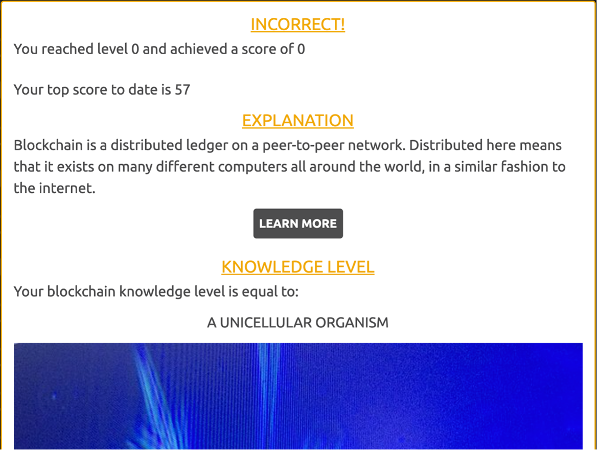</div>

<div align="center">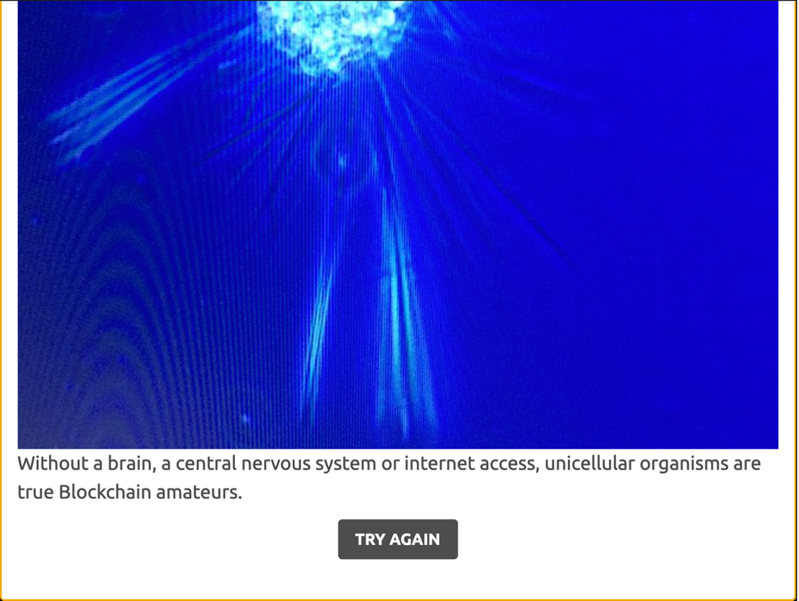</div>

<div align="center">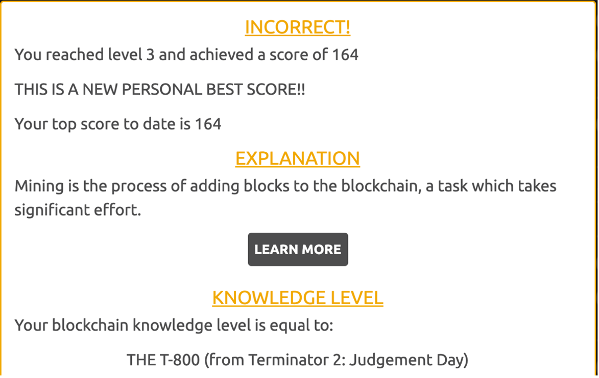</div>

<div align="center">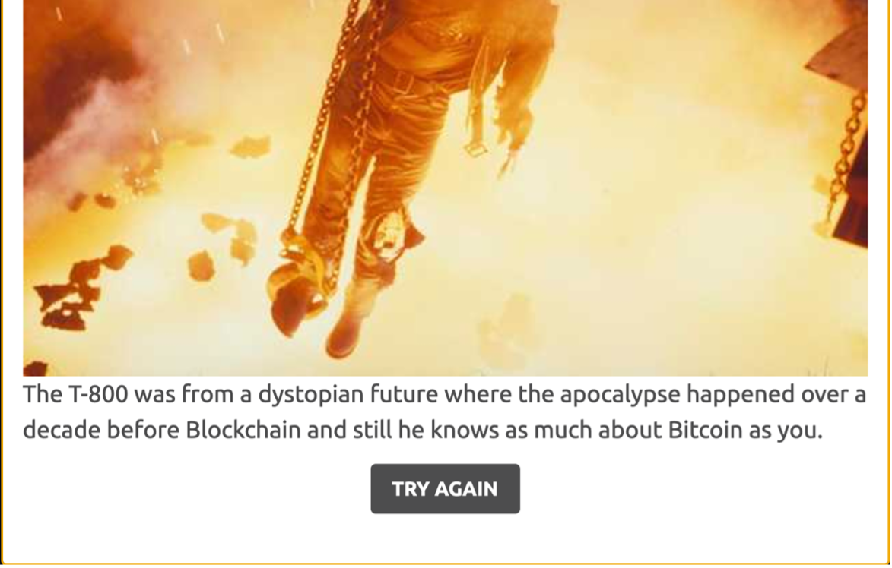</div>

The winner modal is similar to the loser modal in both form and function. The difference here is that there is no explanation provided, since the user has correctly answered all questions, and the option is to progress to the winner’s area, as show below.

<div align="center"></div>

<div align="center"></div>

##### **Winner's Area**
The winner’s area is only accessible through completion of the quiz (unless someone guesses the address, of course!). It comprises of three parts: a winner notification, a prize, and some further information. The winner notification is shown below and is of course very basic.

<div align="center">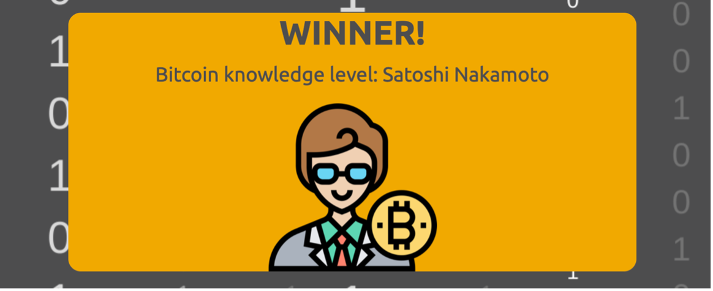</div>

The key part of the winner’s area is the prize. The HTML Canvas element (shown below) displays a piece of ‘art’ that is based on the hash from the latest block in the Bitcoin blockchain. Since this updates every ten minutes, this means in most cases this will be a completely unique prize. The initial intention here was to use the initial block in the blockchain and therefore guarantee that each prize was unique; however, without server-side storage there wasn’t any way to implement this.

The MDN Web Docs [Canvas Tutorial](https://developer.mozilla.org/en-US/docs/Web/API/Canvas_API/Tutorial) was vital in achieving this.

<div align="center">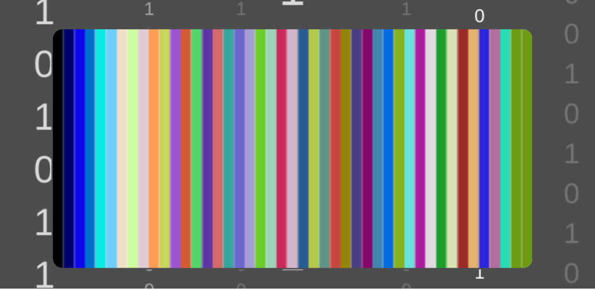</div>

To achieve this, the code below is executed on page load. First, it pulls the latest hash from the [Blockchain API](https://www.blockchain.com/api) and defines it at latestHash. Then, it checks that this hash is ok, otherwise displaying an error message, as per [Javascript.info]( https://javascript.info/fetch). After this, it defines the variable hashRows, which is the 64-digit hash broken into four 16-digit rows for easier display on screen, which is subsequently performed. Finally, the drawArt function is called.

```javascript
// ---------------------------------  MAIN FUNCTION ON PAGE LOAD
document.addEventListener("DOMContentLoaded", async function(){

    // defines the function to fetch the latest hash from the plaintext API
    let latestHash = await fetch('https://blockchain.info/q/latesthash')
  
    // makes sure the hash returned is ok (the server is responding)
    // code learnt from https://javascript.info/fetch 
    if (latestHash.ok){
        // if the server responds, hash represents the response
        var hash = await latestHash.text();
    }
    else {
        // otherwise, show an alert message with the status
        window.alert("HTTP-Error: " + hash.status);
    }

    // splits the hash into manageable arrays (see below)
    let hashRows = splitHash(hash);

    // adds the hash into the text on screen below the canvas so users can see the hash used
    document.getElementById("hash").innerHTML += hashRows[0].join('') + "<br/>" + hashRows[1].join('') + "<br/>" + hashRows[2].join('') + "<br/>" + hashRows[3].join('');

    // draws the unique art
    drawArt(hash, hashRows);
})
```

The drawArt function is outlined below. After defining the necessary variables, this function takes the hash value and the 45 colours to be coded (code following), and cycles through the code, adding 45 colourful vertical rectangles, each 1/45th of the width of the canvas.

```javascript
// this function displays some unqiue artwork on the canvas
function drawArt(hash, hashRows){
    // gets the canvas element
    var canvas = document.getElementById('art');
    // defines width/height for later use
    var width = canvas.width;
    var height = canvas.height;
    // gets the colours to be used (see function)
    let colours = getColours(hash)

    // begins the art (if function will return true if canvas accessible)
    if (canvas.getContext){
        // defines the context (where the art will take place) as art
        var art = canvas.getContext('2d');
        // basic iterative variable for loop
        var i;
        // sets transparency, here fully opaque
        art.globalAlpha = 1.0;
        // cycles through the 45 six-part hexadecimal codes that the get colours function returns (see below)
        for (i = 0; i < 45; i++){
            // turns the codes into hex colours
            art.fillStyle = '#' + colours[i];
            // uses the colours to draw vertical lines (rectangles) down the canvas 
            art.fillRect(((i * width) / 45), 0, (width/45), height);
        }
    }
}
```

To obtain the colours to be used, the getColours function is shown below. This code uses two loops, one nested within the other. This allows for each possible colour code within the hash to be extracted.

The first loop begins at 14, which eliminates what would be 14 six-digit codes that would be all zero, due to the initial 19 numbers being zero. From number 14, however, the final digit is potentially non-zero, which would create a non-black colour (black being #000000). Beginning at 14, the first loop selects the digit to begin at, and the second loop adds the six digits to a temporary array in consecutive order. Then, the join function concatenates these into a six-digit string that is defined as newColour before being pushed out of the loops and into the colours array, defined earlier. The order here is important, since the newColour and temporary array are re-used for each loop, whereas the colours array builds up a collection of new colours to use for the artwork.

```javascript
// this function determines the hex colours using the hash hexadecimals
function getColours(hash){
    // hash split into individual characters
    let hashArray = hash.split('');
    var i;
    var j;
    var colours = [];
    // there are 58 rows of six consecutive hexadecimals within a 64-digit hash
    // beginning at 14 accounts for the first 19 consecutive zeros
    // by starting at #14, the 6-number block will reach #20 from the beginning which may be non-zero
    // first for loop sets the starting point within the 64-digit array
    for (i = 14; i < 58; i++){
        // within this first for loop, a fresh blank temporary array is created
        var temporaryArray = [];
        // the second for loop collects the six hexadecimals in order and adds them to the temporary array
        for (j = 0; j < 6; j++){
            temporaryArray.push(hashArray[i+j]);
        }
        // after the second loop, a new colour variable is created out of the temporary array
        var newColour = temporaryArray.join('');
        // this new colour, on its dying breath, is pushed out of both loops to the colours array
        colours.push(newColour);
    }
    // the colours array is returned
    return colours
}
```

Finally, the information box on the home screen displays the hash being used (as per the earlier code) and the additional options.

<div align="center">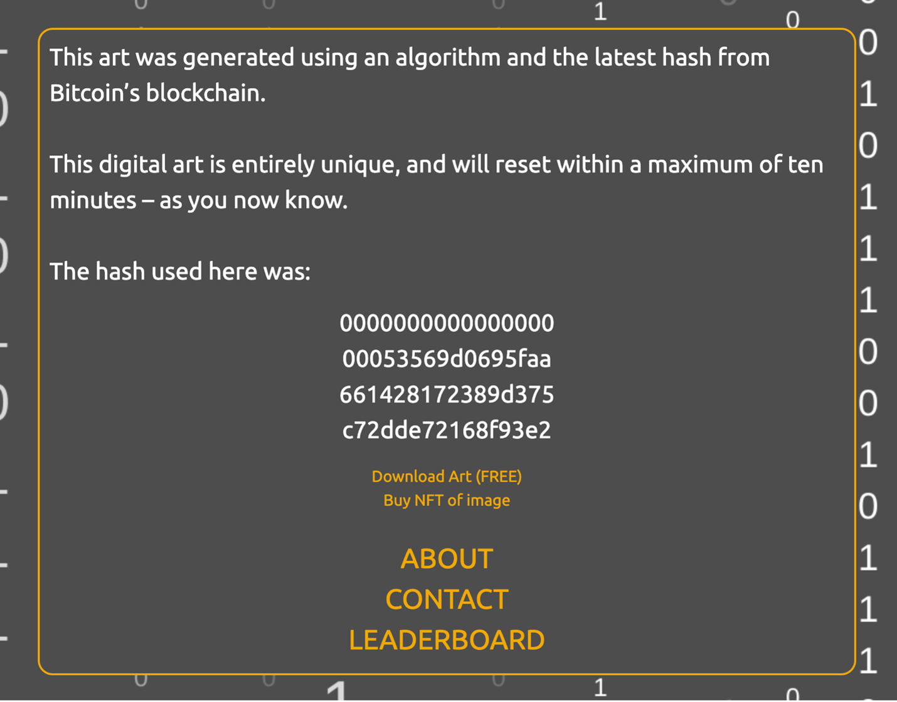</div>

The code for downloading the image was adapted from [JS Fiddle]( https://jsfiddle.net/user2314737/28wqq1gu/) to remove an in-line JavaScript. The code is below.

```javascript
// function to allow image download from the canvas
// code adapted (to remove inline JS) from https://jsfiddle.net/user2314737/28wqq1gu/
document.getElementById("download").onclick = function(){
    var canvas = document.getElementById('art');
    var image = canvas.toDataURL("image/jpg");
    document.getElementById("download").href = image;
}
```

The NFT option is added but not yet implemented, and as such only displays an alert box to inform the user this is coming soon. Before this is implemented, the artwork would need to be expanded. However, by including this, it invites users to return in the future.

The three final options are: about, contact, and leaderboard. These three options take advantage of modals once again, in keeping with the style of the site. These are shown below and are intentionally minimal to limit the user’s options. Ideally, I want users to connect with me on Twitter, which is where I will be most active regarding my projects. I’ve added a link to this README, however, as it is quite in-depth and may benefit some new developers.

<div align="center">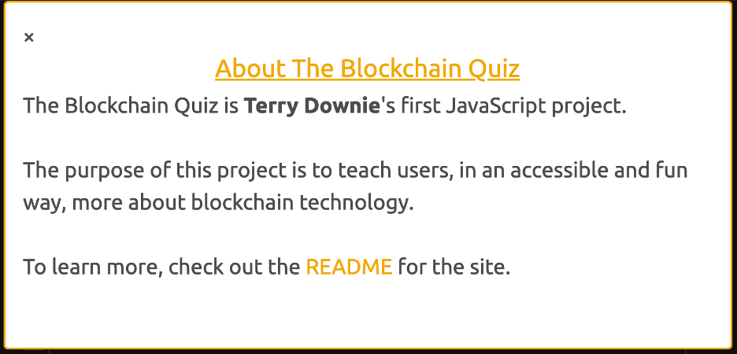</div>

<div align="center"></div>

<div align="center"></div>

#### **Responsiveness**
From inception to development, the site has been designed using a mobile-first approach. The content is minimal, with most elements appearing and disappearing within a small window. As such, there was no need for extensive responsiveness amendments. Instead, I used one small screen breakpoint whereby text elements would shrink to fit within the screen or their respective boxes, and one larger screen breakpoint to enlarge certain text elements so they did not look out of place on larger screens.

These breakpoints are:
- 330px
- 800px

These minor changes were achieved using media queries and CSS.

##### **Drag & Drop**
After implementation, I came to learn that the Drag & Drop API does not function on touch screens. As such, the quiz.html page was replicated, and the drag & drop questions were replaced with radio button questions on this version. Then, an event listener was embedded into the JavaScript for the landing page that changed the link within the begin button on the opening modal, essentially funnelling touchscreen users into their own separate, touchscreen-accessible quiz.


#### **Accessibility**
The following accessibility considerations are based on the best ‘checklist’ I could find, designed by Aaron Cannon, a blind web developer and accessibility consultant. Aaron isn’t a fan of accessibility checklists, and I find the best work is often done by those critical of the current status quo. The checklist is in the credits section at the end.

##### **Mark-up**
•	Structure and presentation are separated, with zero in-line CSS used in the HTML document which can affect screen-readers.
•	The primary language (English) is outlined in the HTML head using the lang attribute.
•	Proper mark-up has been used for each element type, such as sections, headings, paragraphs, etc.
•	Headings are used in correct order without skipping any in the hierarchy and H1 is only used once.
•	The page titles are meaningful and accurate.
•	Skip to main has NOT been implemented in this instance since there are no links that would need to be skipped.
•	HTML is in the proper readable order therefore tab index is not necessary*.

*At first, I intended to use tab index for the eleven questions since they are all present within the HTML and as such may confuse those using keyboards to navigate. However, since the elements are hidden until such a time comes, I don’t believe this to be necessary.

##### **Visual Appearance and Content**
•	The website is still viewable and readable with images turned off as per chrome extension.
•	The website remains readable at 200% zoom.
•	Not all page elements can be tabbed to since there are interactive elements. Unfortunately, I am not 100% certain how this will function across the full breadth of accessible requirements. This is an area that I will have to spend more time to grasp the implications of such features as a timer and hidden content.
•	Headings and link text are all descriptive enough not to require additional tags.
•	The colours used in the design of the website meet the WCAG double A standard, with a contrast ratio of at least 4.2:1. This is not as high a contrast as I would prefer; however, this was for the orange text on grey, and the instances of which use bold enough text to meet the [double A standard](https://webaim.org/resources/contrastchecker/).
o	Note: to avoid the orange on white the buttons have been adjusted, and as such differ from the earlier screenshots
•	No content flashes or blinks more than three times per second.
o	Note: the typewriter animation runs faster than this but is not blinking or flashing
•	The focus indicator is not hidden.
•	Colour is not used to convey meaning.

##### **Dynamic Content**
•	The only dynamic content is the basic text animations outlined above, the likes of which should not cause a problem.

##### **Images and Multimedia**
•	All images have appropriate alt text that achieves brevity without losing meaning.
•	There are no videos.

##### **Forms**
•	There are no CAPTCHAs

##### **Drag & Drop**
As with touchscreens, the Drag & Drop API does not function well with alternative viewing options. As such, the quiz.html page that was replicated for responsiveness was added as an accessible option upon beginning the quiz, but only provided the site has not already recognised the user is using a mobile device, since this would then be a moot point. The accessible and touchscreen options are identical to the main quiz, except the drag and drop questions are replaced with multiple choice questions.

### <div align="center">Technology Used</div>

#### **Languages (Links)**
•	[HTML5](https://en.wikipedia.org/wiki/HTML5)
•	[CSS3](https://en.wikipedia.org/wiki/CSS)
•	[JavaScript](https://en.wikipedia.org/wiki/JavaScript)

#### **Frameworks, Libraries & Tools**
•	[Git](https://git-scm.com/) was used for version control.
•	[GitHub](https://github.com/) was used to host the repository and to deploy the website via GitHub pages.
•	[Gitpod](https://www.gitpod.io/) was used as a development area.
•	[Bootstrap 4.1.3](https://getbootstrap.com/) was used for minimal styling.
•	[Google fonts](https://fonts.google.com/) were used to import the font used.
•	[Canva](https://www.canva.com/en_gb/) was used to edit the image and some icons before importing into Gitpod.
•	[Figma](https://www.figma.com/) was used to create the wireframes and mockups during the design process.
•	[MS Word](https://www.microsoft.com/en-gb/microsoft-365/word) was used to type this README before deployment.
•	[Chrome Dev Browswer](https://google-chrome-dev.en.softonic.com/mac) was used for online access to the tools mentioned here.
•	[Am I Responsive](http://ami.responsivedesign.is/#) was used for displaying the opening image.

## <div align="center">PART 3: TESTING & DEPLOYMENT</div>
### <div align="center">Testing & Fixes</div>

The website was tested from various angles: code, user perspectives, functionality and responsiveness/accessibility.

#### **Testing Code**
The code was ran through the following code validators. This resulted in minor adjustments before repeating the process. Details are below.
•	[W3C Markup Validator](http://validator.w3.org): multiple errors.
o	Some of my tags are empty or missing attributes such as alt text and src but these errors were all due to JavaScript adding these accordingly.
o	Possible misuse of aria-label highlighted, however this has been used in instances where I believe it will benefit the user (emojis, for example).
o	Footer tag has no content. There is no footer content to add, and I could not find if this tag was absolutely essential. Here, I erred on the side of caution and left it in.
•	[W3C CSS Validator](https://jigsaw.w3.org/css-validator/): pass no errors.
•	[W3C Link Checker](https://validator.w3.org/checklink): all links valid.

#### **Testing User Stories**
The site’s primary users, those looking to learn more about blockchain technology, will want:
1.	To understand immediately and with definitive clarity the purpose of the site and its relevance to them in their quest to learn more about Blockchain.
-	The landing page greets the user with the self-explanatory title to the site.

2.	To test their existing Blockchain knowledge.
-	The entire site is geared up to engage with users and funnel them into the quiz whereby they can test their existing knowledge.

3.	To fill any Blockchain knowledge gaps.
-	Upon getting any question wrong, the users are greeting with an explanation and a link to learn more via Bitcoin Wiki.

4.	To enjoy using the site.
-	The use of emojis, knowledge level, user scores and a prize are all to ensure the user has fun in the process.

5.	To learn more about the site and its purpose.
-	At the end of the quiz, there is an about modal with links to this comprehensive README.

6.	To connect with the creator of the site since this is a burgeoning field.
-	At the end of the quiz, there is a contact modal with my preferred contact method.

Return visitors will want to:
1.	Have a positive return experience.
-	The personalised homepage guarantees a positive return experience from the get-go.

2.	Try the quiz again if they have not yet completed it.
-	As with new users, return users are funnelled back into the quiz with the added emphasis of a tailored welcome message reminding them they still have more to learn.
 

#### **Testing Functionality**
I tested the functionality of the site by completing the following tests:
•	I tried all links.
o	Off-site links open in a new browser
o	On-site navigation links work properly
•	I tested the website on the three most-used browsers.
o	Safari
o	Chrome
o	FireFox

#### **Testing Accessibility & Responsiveness**
•	I tried this project on a range of screens:
o	An iPhone 5 with a 4” screen
o	An iPhone XS with a 5.8” screen
o	An iPad Pro with a 10.5” screen
o	A MacBook Pro with a 13” screen

•	The site was tested for accessibility use the Web Accessibility Evaluation Tool and all errors were within the design of the site, with the exception of the download art/NFT links in the winner’s area. As such, the size of these were increased in line with accessibility guidelines. The results can be seen [here](https://wave.webaim.org/report#/https://trdownie.github.io/the-blockchain-quiz/).

#### **Fixed Bugs**
Disappearing h1 headings
My h1 element on the quiz and winner’s area was not displaying since the h1 tag had an opacity of zero. This was due to the code I adapted for fading in the title on the index page using the ‘getElementsByTagName()’ feature on h1. When I instead targeted the element using ‘getElementById()’ with the intention of pointing the function at a div, my code didn’t work. As such, I had to use h2 elements for the main headings on the quiz and winner’s area pages.

On less caffeine and more sleep I realised this was due to the addition of an index value in the ‘getElementsByTagName()’ function, specifically [0], which rendered the code useless when combined with the ‘getElementsById()’ function since ID’s are inherently unique.

#### **Known Bugs**
•	There are no known bugs with this website. If you spot one – please [get in touch] (mailto:trdownie@gmail.com).


### <div align="center">Deployment</div>

#### **GitHub Pages**
This project was deployed using GitHub Pages. To do this:
1.	Create GitHub account/login to GitHub
2.	Create/locate the Repository you want to deploy
3.	Locate the Settings button above the Repository
4.	Scroll until you reach the GitHub Pages section
5.	Under Source, change None to Master Branch
6.	The page will refresh
7.	Scroll back down to the GitHub Pages section and you will find the newly published page link

#### **Forking GitHub Repositories**
Repositories can be forked, which essentially makes a copy so that anyone can work on it without affecting the original copy. To do this:
1.	Create GitHub account/login to GitHub
2.	Create/locate the Repository you want to fork
3.	Locate the Fork button (above the repository and Settings button)
4.	Click the Fork button to create a copy of the original Repository in your GitHub account

#### **Making a Local Clone**
You can clone a repository and store it locally. To do this:
1.	Create GitHub account/login to GitHub
2.	Create/locate the Repository you want to clone
3.	Click the button underneath the Repository that says Clone or Download
4.	To clone the repository using HTTPS, under Clone with HTTPS, copy the link
5.	Open Git Bash
6.	Change the current working directory to the location where you want the cloned directory to be made
7.	Type git clone, and then paste the link you copied in Step 4
8.	Press enter and your local clone will be created

### <div align="center">Limitations & Improvements</div>
Limitations due to competence level or time constraints are outlined here, followed by suggested future improvements.

#### **Current Limitations**

##### **Interactivity**
I am not thrilled with the fallback drag & drop functionality, since I am aware there are workarounds for screen readers and touchscreens. As such, this is a limitation, considering that not all users enjoy the same experience. This will be a priority to fix in the next update, however time constraints meant this was not possible.

##### **Drag & Drop functionality**
The drag & drop functionality is inherently limited. The drop areas accept multiple inputs and does not allow ‘undo drop’, meaning that if a user selects the wrong first answer, they fail the question. This is obviously not ideal and a clear limitation of this feature.

##### **Multiple Choice Radio Button Styling**
The styling on the radio buttons could be improved. I have not had chance to delve into this at this point.

#### **Future Improvements**

##### **Art**
From the beginning, it was my intention to have a more ‘art-like’ piece of art generated by the input hash. I will expand on this at the earliest convenience to include the likes of small quadratic and cubic Bezier curves alongside the moveTo() function, to see if I can obtain a Jackson Pollock-like rendering of the hash.

##### **NFT**
Once the above is achieved, I will connect the site to an external resource that allows the sale of NFTs for 1 Ethereum per piece. Who knows – there may be a market for such antics.

##### **Multiple Choice Radio Button Styling**
The styling on the radio buttons could be improved. I have not had chance to delve into this at this point.

##### **Scope**
At present, this quiz repeats the same 11 questions. Ideally, it would pull from a pool using the math random functionality, thereby keeping the experience fresh for repeat users and expanding on the scope of the knowledge imbued. This would be complex with the current design regarding User Levels, however, and would require eleven question pools of increasing complexity. This was too much for time constraints on this first run.

##### **Interactivity**
I have a number of interactive ideas, from drag & drop Merkle tree diagrams to a live action hashing algorithm where the user must ‘mine’ an answer, that I would have liked to have included. Naturally, these sit beyond the natural constraints of such a project, but may be added in the future.

### <div align="center">Credits</div>

#### **Code**
All code was written entirely by the developer, with the exception of code that was adapted from the following places:

- How to [create modals](https://www.w3schools.com/howto/howto_css_modals.asp)
- How to make text [appear](https://stackoverflow.com/questions/2207586/how-do-you-make-something-to-appear-slowly-on-a-page-using-javascript)
- How to use [fetch functions](https://javascript.info/fetch) for API integration
- How to [download an image](https://jsfiddle.net/user2314737/28wqq1gu/) from the Canvas API

#### **Copy**
All copy was written by the developer.

#### **Media**
All images were created by the developer with the exception of the following.

##### **Film Images**
No permissions have been given for the use of these images, and all images are shots from movies. As per UK copyright laws, these are lesser versions than the originals and are used to add context and not simply for decorative purposes.

The images were obtained from the following places:

-	[Den of Geek](https://www.denofgeek.com/movies/the-19-best-artificially-intelligent-movie-characters-ex-machina-2001-ai/)
-	[Hackaday](https://hackaday.io/project/19834-deep-thought)
-	[CBR](https://www.cbr.com/watchmen-dr-manhattans-greatest-powers-ranked/)
-	[We Love Making Movies](http://welovemakingmovies.blogspot.com/2010/02/un-personaje-marvin.html)

##### **Science Image**
The unicellular organism has a creative commons license and was obtained from [Wiki Commons](https://commons.wikimedia.org/wiki/Main_Page).

#### **Information**
I consulted a range of informational sources to complete this project. They are listed here:

- [Bitcoin Wikipedia](https://en.bitcoin.it/wiki/Main_Page) for general info
- [Techopedia](https://www.techopedia.com/) for general info
- [Investopedia](https://www.investopedia.com/) for general info
- [Fontmeme](https://fontmeme.com/bitcoin-logo-font/) for the Bitcoin logo font
- [Design Pieces](https://www.designpieces.com/palette/bitcoin-colour-palette-hex-and-rgb/) for the Bitcoin colour palette
- [Stack Overflow](https://stackoverflow.com/questions/3583724/how-do-i-add-a-delay-in-a-javascript-loop) for adding delays to a loop
- [Geeks for Geeks](https://www.geeksforgeeks.org/how-to-add-a-delay-in-a-javascript-loop/) for the same
- [Developer Mozilla](https://developer.mozilla.org/en-US/docs/Web/API/Canvas_API/Tutorial) for using the Canvas API
- [Blockchain.com](https://www.blockchain.com/api) for the Blockchain API
- [W3](https://www.w3.org/WAI/tutorials/forms/grouping/) for the accessibility of forms
- & Aaron Cannon for [The Accessibility Checklist I Vowed I’d Never Write](http://northtemple.com/1608/)

#### **Acknowledgements**
I would like to thank:
•	[Code Institute](https://codeinstitute.net/) for the material and [Medale Oluwafemi](https://github.com/omedale) for the mentoring.
•	My family and those around me who put up with 72-hour plus reply times to messages when I’m deep into the syntax, both code and conventional.
•	The countless people before me who’ve iteratively built human civilisation to this point. We live in exciting times and I’m eternally grateful for that fact.


